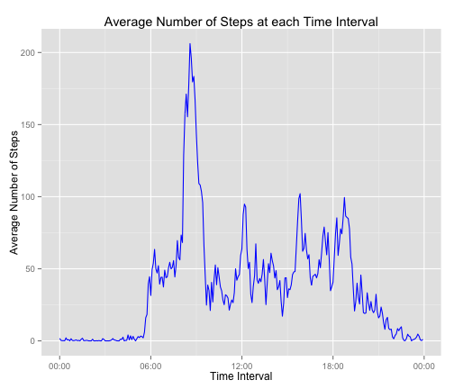
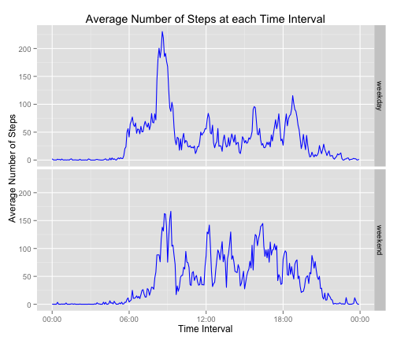

# Reproducible Research: Peer Assessment 1
    
Setting the environment and loading the libraries required


```r
## set global options to show code
opts_chunk$set(echo = TRUE)
```


```r
## load the required libraries
library(knitr)
library(ggplot2)
library(chron)
library(plyr)
```


```r
## Set timezone to GMT
Sys.setenv(TZ='GMT')

## disable scientific notation
options(scipen=999)
```


## Loading and preprocessing the data

```r
## Create subfolder "temp" in working directory if it does not exists
if (!file.exists("./activity.csv")) {
        unzip("./activity.zip")
        }
## readcsv data file
ds <- read.csv("./activity.csv")

## set column 'date' to date format
ds$date <- as.Date(ds$date, format = "%Y-%m-%d")

## set column 'interval' to time format %H:%M:%S
ds$interval <- sprintf("%04d", ds$interval)
ds$interval <- gsub("^(.{2})(.*)$", "\\1:\\2:00", ds$interval)
ds$interval <- times(ds$interval)
```


```r
head(ds)
```

```
##   steps       date interval
## 1    NA 2012-10-01 00:00:00
## 2    NA 2012-10-01 00:05:00
## 3    NA 2012-10-01 00:10:00
## 4    NA 2012-10-01 00:15:00
## 5    NA 2012-10-01 00:20:00
## 6    NA 2012-10-01 00:25:00
```

## What is mean total number of steps taken per day?

```r
## tabulate total number of steps taken each day
total <- aggregate(ds$steps, by = list(ds$date), "sum", na.rm = TRUE)
colnames(total) <- c("date", "total_steps")

## plot histogram of the total number of steps taken per day using base system 
par(ps = 12)
hist(total$total_steps, xlab = "Total Steps", main = "Histogram of Total Steps")
```

 

```r
## calculate mean and median total number of steps taken per day
mean.steps <- round(mean(total$total_steps), 0)
median.steps <- round(median(total$total_steps), 0)
```
The **mean** of total number of steps taken per day is: **9354**.  
The **median** of total number of steps taken per day is: **10395**

## What is the average daily activity pattern?

```r
## tablulate average steps taken for each interval 
average.ds <- aggregate(ds$steps, by = list(ds$interval), "mean", na.rm = TRUE)
colnames(average.ds) <- c("interval", "average_steps")

## plot time-series graph of interval against average number of steps across
## all days
g <- ggplot(data = average.ds, aes(x = interval, y = average_steps))
g + geom_line(aes(group = 1), colour = "blue") + labs(x = "Time Interval") + 
        labs(y = "Average Number of Steps") +
        labs(title = "Average Number of Steps taken at each 5-minute Interval") + 
        scale_x_chron(format = "%H:%M")
```

 

```r
which.interval <- as.character(average.ds[average.ds$average_steps == 
                                                  max(average.ds$average_steps), ]$interval)
```
**08:35:00** contains the maximum average number of steps across all the days in the dataset.

## Imputing missing values

```r
## find the number of rows with NA in column 'steps'
missing.rows <- which(is.na(ds$steps))
missing <- length(missing.rows)
```
The total number of rows with NA is **2304**.  

#### *Strategy for filling in the missing values*
We will be using a simple strategy to replace NAs with the mean for that 5-minute interval.


```r
## append the average steps across all days for each interval to the
## data.frame ds.new, for rows with NA values in steps, it will be 
## replaced with mean for that 5-minute interval
ds.new <- join(ds, average.ds, by = "interval")
ds.new$steps <-  ifelse(is.na(ds.new$steps), ds.new$average_steps, ds.new$steps)
ds.new <- subset(ds.new, select = (-average_steps))
```


```r
## tabulate total number of steps taken each day with the imputed missing 
## values dataset
total.new <- aggregate(ds.new$steps, by = list(ds.new$date), "sum", na.rm = TRUE)
colnames(total.new) <- c("date", "total_steps")

## plot histogram of the total number of steps taken per day using base system
## with the imputed missing values dataset
par(ps = 12)
hist(total.new$total_steps, xlab = "Total Steps", main = "Histogram of Total Steps")
```

 

```r
mean.steps.new <- round(mean(total.new$total_steps), 0)
median.steps.new <- round(median(total.new$total_steps), 0)
```
| Description                     | Mean | Median |
|:--------------------------------|:------------------:|:--------------------:|
|Original datasets with NA values: | 9354     | 10395      |
|Imputed missing values dataset:   | 10766 | 10766 |

Impact: Imputing missing values resulted in higher mean and median values as compared to the orignal datasets.

## Are there differences in activity patterns between weekdays and weekends?

```r
## create new column 'day' of factor type to indicate whether the date is a weekday or weekend
ds.new$day <- ifelse(weekdays(ds.new$date) %in% c("Saturday", "Sunday"), "weekend", "weekday")
ds.new$day <- factor(ds.new$day)

## tabulate average steps taken for each interval for weekday and weekend 
average.ds.day <- aggregate(ds.new$steps, by = list(ds.new$interval, ds.new$day), "mean", na.rm = TRUE)
colnames(average.ds.day) <- c("interval", "day", "average_steps")

## plot time series of 5-minute interval against the average number of steps taken across all days, 
## 1 graph for weekday, 1 graph for weekend
g <- ggplot(data = average.ds.day, aes(x = interval, y = average_steps))
g + geom_line(aes(group = 1), colour = "blue") + 
        facet_grid(day ~ .) + 
        labs(x = "Time Interval") + 
        labs(y = "Average Number of Steps") +
        labs(title = "Average Number of Steps at each Time Interval") + 
        scale_x_chron(format = "%H:%M")
```

 
